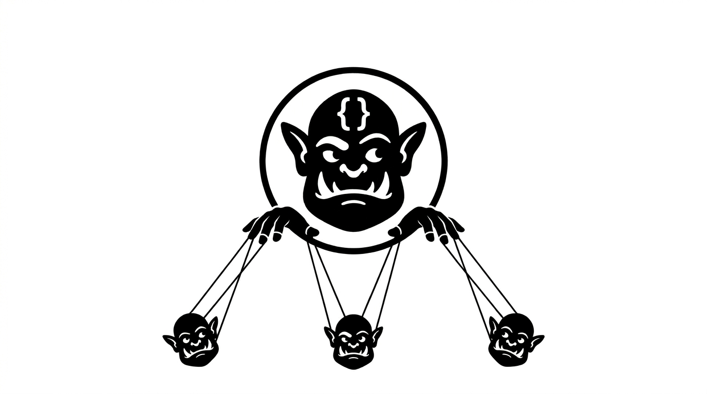

# OrcAI CLI

<p align="center">
  
</p>

A CLI tool for orchestrating bulk GitHub work across many repositories. From a single YAML config, OrcAI creates a GitHub Project, opens templated issues in every target repo, and hands them off to whoever (or whatever) does the work — a human teammate, a bot, or an AI agent like GitHub Copilot or OpenCode.

## Features

- **Declarative YAML jobs** — one config defines the project, repos, issue template, and an `action` to run after creation.
- **Bulk, idempotent** across any number of repos — a lock file makes re-runs free; glob/brace expansion fans out over many configs.
- **GitHub Project auto-management** — finds or creates the board and links every issue to it.
- **Flexible actions** — assign `@copilot`/anyone, post a triggering comment, or actually do the work: `cmd-to-github` clones, runs a command (e.g. an AI coding agent), commits, and opens a PR.
- **Local provider** — `provider: local` tracks state as files on disk instead of GitHub, for offline dry-runs.
- **`orcai nudge` / `orcai notify`** — re-trigger stale issues with no PR yet, or broadcast a templated status comment.
- **Auto issue-body updates** and per-repo prepend/append overrides on top of the shared template.
- **Dependent jobs** (`dependsOn`) — chain jobs on an upstream PR merge or issue close; `orcai graph` visualises the chain.
- **`orcai migrate`** — upgrade job YAML/lock files to the current schema in place, no re-sync required.
- **Built for scale** — rate limiting with retry, concurrency control, `--continue-on-error`, JSON output, and PAT/App/`gh`-CLI auth.

## Why OrcAI

Rolling out the same change across dozens of repos by hand doesn't scale — cloning each one, opening an issue, remembering who to assign, checking back for a PR, and cleaning up afterwards. OrcAI turns that into one YAML file and one command: it tracks what it created, is safe to re-run, and can hand the actual work to a human, `@copilot`, another bot, or a coding agent it drives itself via `cmd-to-github`.

## Installation

OrcAI is distributed as a .NET global tool. Requires [.NET 10](https://dotnet.microsoft.com/download) or later.

```bash
dotnet tool install --global OrcAI.Tool
```

Then run it as `orcai`.

## Prerequisites

- **`gh` CLI**: Install from [cli.github.com](https://cli.github.com/) — must be installed and on `PATH`
- **Authentication**: The easiest option is to ensure `gh` is authenticated (`gh auth login`). OrcAI will use it automatically. For other methods see [docs/cli-reference.md](docs/cli-reference.md).

## Quick start

### 1. Authenticate

The simplest option — if you already use the `gh` CLI, just make sure it's authenticated:

```bash
gh auth login
```

That's it. OrcAI will pick up the token automatically.

For PAT, GitHub App, or environment variable auth see [docs/cli-reference.md](docs/cli-reference.md).

### 2. Scaffold a job

`orcai generate` writes a starter YAML config and a stub Markdown issue template so you're not writing either from scratch:

```bash
orcai generate --name "Add AGENTS.md" --org my-github-org --repo repo-one --repo repo-two
```

```
Generated:
  ./add-agents-md.yml
  ./add-agents-md.md
```

`add-agents-md.yml` looks like this — fill in the `TODO`s (repos, labels, and the `action` block are the ones worth a look) and write the actual task in `add-agents-md.md`:

```yaml
version: 2  # schema version; used by 'orcai migrate' — don't edit by hand

job:
  title: "Add AGENTS.md"
  org: "my-github-org"

repos:
  - "repo-one"
  - "repo-two"

issue:
  template: "./add-agents-md.md"
  labels: []
  # TODO: add label names, e.g. ["automated", "migration"]

# action:
#   type: assign-copilot  # default; omit this block to assign @copilot
#   comment: ""  # optional trigger comment

# nudge:
#   mode: reassign       # reassign | comment-only | comment-and-reassign
#   comment: ""          # nudge comment body; supports {assignee} placeholder
```

Passing `--interactive` instead of `--repo` prompts for the missing values and shows a multi-select picker populated from `gh repo list <org>`. See [example/](example/) for complete, runnable configs — including `cmd-to-github` driving an AI coding agent end-to-end.

### 3. Run it

```bash
# Single config file
orcai run add-agents-md.yml

# All configs in a directory (quote the glob to prevent shell expansion)
orcai run "jobs/*.yml" --continue-on-error --json

# Limit concurrency to avoid rate limits
orcai run "jobs/*.yml" --max-concurrency 2
```

`run` finds or creates a GitHub Project, creates issues from your template, adds them to the project, and triggers the configured `action` — whether that's assigning `@copilot`, another bot, or a human teammate, or actually running a command (an AI coding agent, a script) and opening a PR with the result. On success a lock file (`<basename>.lock.json`) is written alongside the YAML for fast idempotent re-runs.

## Commands

| Command | Description |
|---------|-------------|
| `orcai auth pat/app/create-app/switch` | Store credentials or switch profiles for all other commands |
| `orcai generate` | Scaffold a YAML job config and stub issue template |
| `orcai run` | Execute a bulk upgrade job (supports globs, concurrency control, JSON output) |
| `orcai nudge` | Re-trigger stale issues with no linked PR (reassign, comment, or both) |
| `orcai notify` | Post a templated comment to issues and/or PRs from the lock file |
| `orcai validate` | Validate YAML config(s) and verify all repos are accessible |
| `orcai info` | Display the current state of a job |
| `orcai cleanup` | Tear down everything created by `run` |
| `orcai graph` | Render the `dependsOn` dependency graph as an ASCII tree |
| `orcai migrate` | Upgrade a job YAML and its lock file to the current schema version |

For full flag details, output formats, lock file schema, and advanced usage see [docs/cli-reference.md](docs/cli-reference.md). For config file settings see [docs/config.md](docs/config.md).

The original Nushell scripts (`orca.nu`, `cleanup.nu`) are documented in [docs/nushell-scripts.md](docs/nushell-scripts.md).
